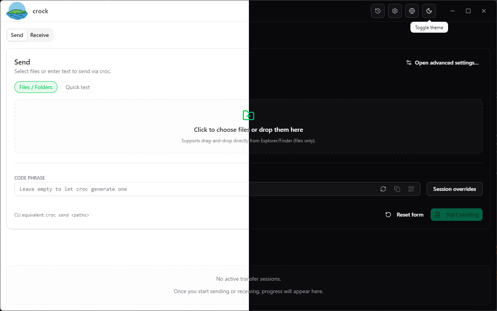
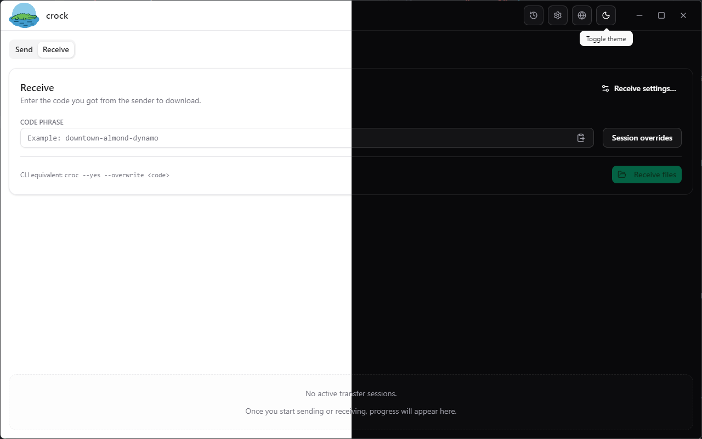
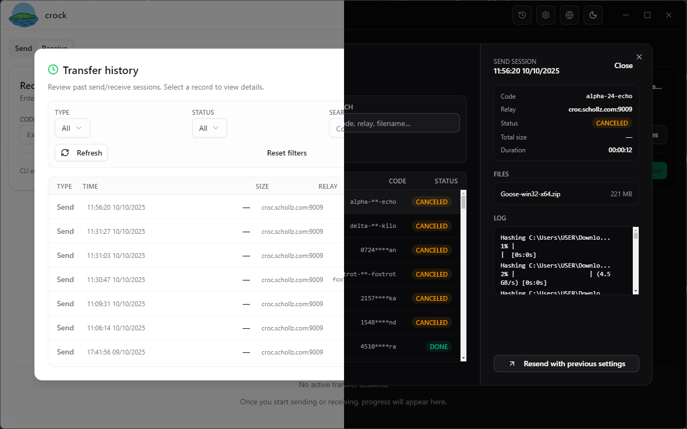
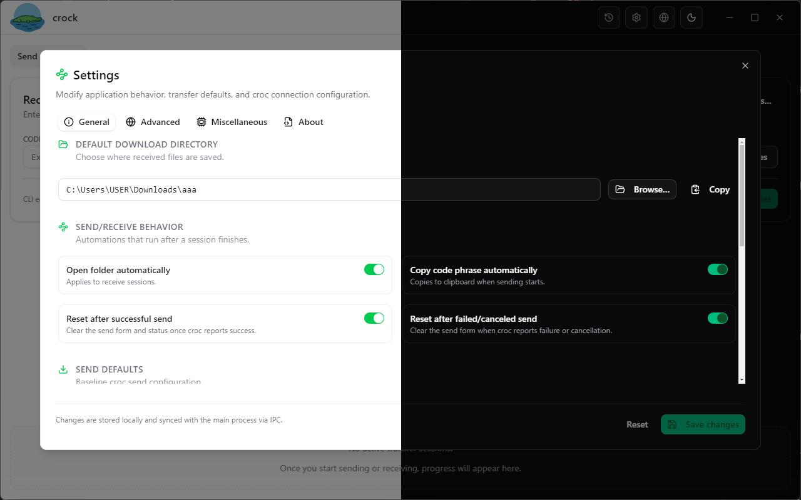

# Crock UI


> [croc](https://github.com/schollz/croc) を Electron + React で包み込み、ピアツーピア転送を GUI で快適に操作できるデスクトップコンパニオンです。

## 目次

- [Crock UI](#crock-ui)
  - [目次](#目次)
  - [概要](#概要)
  - [主な機能](#主な機能)
  - [スクリーンショット](#スクリーンショット)
  - [アーキテクチャ](#アーキテクチャ)
    - [レンダラー (React + Vite)](#レンダラー-react--vite)
    - [プリロードブリッジ](#プリロードブリッジ)
    - [メインプロセス](#メインプロセス)
  - [プロジェクト構成](#プロジェクト構成)
  - [はじめに](#はじめに)
    - [前提条件](#前提条件)
    - [依存関係のインストール](#依存関係のインストール)
    - [アプリの実行](#アプリの実行)
  - [利用可能なスクリプト](#利用可能なスクリプト)
  - [ビルドとパッケージング](#ビルドとパッケージング)
  - [設定とデータ保存](#設定とデータ保存)
  - [多言語対応](#多言語対応)
  - [ディープリンク（Deep Link）](#ディープリンクdeep-link)
  - [ロードマップ](#ロードマップ)
  - [既知の問題と制約](#既知の問題と制約)
  - [トラブルシューティング](#トラブルシューティング)
  - [コントリビュート](#コントリビュート)
  - [謝辞](#謝辞)
  - [ライセンス](#ライセンス)

## 概要

Crock UI は実績ある `croc` CLI をモダンなデスクトップ体験として提供します。プラットフォームに合わせた croc バイナリを同梱し、常に最新に保ちながら、よく使うワークフローを視覚的なインターフェースに集約します。Electron の堅牢なメインプロセス、React + Vite 製レンダラー、Zustand による状態管理、Tailwind/shadcn ベースの UI、そして CLI 挙動を反映した IPC レイヤーで構築されています。

## 主な機能

- **即時送受信** — ファイルやテキストをキューへ投入し、リレーを選択してワンクリックで croc 転送を開始。
- **コードフレーズの快適操作** — セッションコードの生成・コピー・貼り付け・QR スキャンに対応し、クリップボードとフォームを同期。
- **転送の可視化** — リアルタイム進捗、構造化ログ、履歴ビューアで過去セッションを追跡。
- **柔軟なデフォルト設定** — General / Advanced / Misc / About 各タブから送受信フラグや自動化トグルを調整。
- **リレー・プロキシのヘルスチェック** — リレー、プロキシ、croc バイナリを検査し、メインプロセスからのライブステータスを受信。
- **バイナリ管理ライフサイクル** — GitHub から croc リリースをダウンロード・インストール・ピン留め可能。
- **テーマとローカライズ** — ライト / ダーク / システムテーマ、英語・ベトナム語・日本語の翻訳を同梱。
- **ブラウザ向けモック API** — Electron 以外の環境では安全な `window.api` モックでデザインプレビューを維持。

## スクリーンショット

| 送信                                  | 受信                                     | 履歴                                         | 設定                                                  |
| ------------------------------------- | ---------------------------------------- | -------------------------------------------- | ----------------------------------------------------- |
|  |  |  |  |

その他のプレビューは [`./screenshots`](./screenshots) にあります。

## アーキテクチャ

本アプリは連携する 3 つのレイヤーで構成されています。

### レンダラー (React + Vite)

- `src/main.tsx` で起動し、`App.tsx` を DOM に描画。
- Zustand ストア (`src/stores`) が UI・設定・履歴・転送状態を管理。
- タイプ定義された `window.api` ブリッジ (`src/lib/window-api.ts`) 経由で Electron と通信。
- Tailwind CSS と shadcn 由来のコンポーネント (`src/components/ui`) で一貫したデザインを実現。
- `react-i18next` と `src/locales` の JSON リソースで国際化を提供。

### プリロードブリッジ

- `electron/preload.ts` がレンダラーへホワイトリスト化された型安全 API を公開。
- ファイルダイアログ、クリップボード、ウィンドウ制御、croc ライフサイクル操作、履歴・設定の変換を仲介。
- `events.on` 経由でリレー状態や進捗のストリーミングを提供。

### メインプロセス

- `electron/main.ts` が BrowserWindow、単一インスタンスロック、外部リンクの処理、ライフサイクルを構成。
- `electron/services` のサービス群が croc バイナリの管理、コマンド構築、プロセス起動、リレー監視、`electron-store` での履歴・設定保存を担当。
- `electron/ipc/modules` がサービスをリクエスト / レスポンス形式の IPC チャネルに変換。
- `vite-plugin-electron` が開発時にメイン / プリロード / レンダラーを同時ビルド・ホットリロード。

## プロジェクト構成

```text
crock/
├─ electron/              # メインプロセス・プリロード・IPC モジュール・サービス
├─ public/                # 実行時にバンドルされる静的アセット（ロゴ等）
├─ src/                   # React レンダラー（コンポーネント、ストア、フック、コンテキスト）
│  ├─ components/         # 機能ごとに整理された UI (transfer, settings, history)
│  ├─ lib/                # ユーティリティ (i18n, window API, ヘルパー)
│  ├─ locales/            # i18next リソースバンドル (en, ja, vi)
│  ├─ providers/          # テーマプロバイダーと共有コンテキスト
│  └─ stores/             # IPC と同期する Zustand ストア
├─ dist/                  # レンダラーの本番ビルド出力（生成物）
├─ dist-electron/         # メイン・プリロードのビルド成果物（生成物）
├─ electron-builder.json5 # インストーラー構成
├─ package.json           # スクリプト・依存関係・メタデータ
└─ pnpm-lock.yaml         # 依存関係ロックファイル
```

## はじめに

### 前提条件

- **Node.js** ≥ 18.17 (Electron 30 ランタイム)
- **pnpm** ≥ 9 (同梱の `pnpm-lock.yaml` と整合)
- macOS / Windows / Linux のデスクトップ環境

### 依存関係のインストール

```pwsh
pnpm install
```

### アプリの実行

```pwsh
pnpm dev
```

Vite の開発サーバーと Electron プロセスが同時に立ち上がります。レンダラー・メイン・プリロードの変更はホットリロードされます。

## 利用可能なスクリプト

| スクリプト     | 用途                                                                  |
| -------------- | --------------------------------------------------------------------- |
| `pnpm dev`     | Vite + Electron をホットリロード付きで起動。                          |
| `pnpm build`   | 型チェック、レンダラーのビルド、`electron-builder` によるパッケージ。 |
| `pnpm lint`    | `.ts` / `.tsx` ソース全体に ESLint を実行。                           |
| `pnpm preview` | Electron なしでビルド済みレンダラーを配信。                           |
| `pnpm format`  | 指定グロブに対して Prettier を実行しフォーマット。                    |

## ビルドとパッケージング

```pwsh
pnpm build
```

ビルドパイプラインは以下を実行します。

1. `tsc` がレンダラー・Electron 双方の型チェックを実施。
2. Vite が本番バンドルを `dist/` へ出力。
3. `electron-builder` が [`electron-builder.json5`](./electron-builder.json5) を参照し、プラットフォーム別インストーラーを `release/` ディレクトリに生成。

アイコン、アプリ ID、アップデートチャンネル、署名設定は `electron-builder.json5` で調整できます。

## 設定とデータ保存

- 設定と履歴は [`electron-store`](https://github.com/sindresorhus/electron-store) により、各 OS の `app.getPath('userData')` ディレクトリへ保存されます。
- croc バイナリは `<userData>/bin` にキャッシュし、バージョン管理用マニフェストを付属。
- 転送ログとリレー状態はメインプロセスからストリーミングされ、ウィンドウが閉じるとバックグラウンド監視を停止します。
- リレー状態更新は `RelayStatusMonitor` から発火し、`relay:status` チャネル経由で UI に届きます。

## 多言語対応

- デフォルト言語はベトナム語 (`vi`) で、英語 (`en`) と日本語 (`ja`) を同梱しています。
- 翻訳リソースは `src/locales/<lang>/translation.json` に配置され、`src/lib/i18n.ts` が読み込みます。
- 言語を追加する際は既存ファイルを複製し、`supportedLanguages` にコードを追加して UI 文言を更新してください。

## ディープリンク（Deep Link）

```pwsh
croc://receive?code=<code-phrase>[&relay=<relay-host>][&password=<relay-password>]
```

**パラメータ:**

- `code` (必須): ファイルを受信するためのCROCコードフレーズ  
- `relay` (オプション): カスタムリレーサーバー（ホスト:ポート形式）  
- `password` (オプション): リレーサーバーのパスワード  

**例:**

1. 基本設定での受信:

    ```pwsh
    croc://receive?code=7243-aurora-ceiling-collect
    ```

2. カスタムリレーを使用する場合:

    ```pwsh
    croc://receive?code=7243-aurora-ceiling-collect&relay=custom.relay.com:9009
    ```

3. リレーおよびパスワードを使用する場合:  

    ```pwsh
    croc://receive?code=7243-aurora-ceiling-collect&relay=custom.relay.com:9009&password=secret
    ```

## ロードマップ

- **キーボードショートカット** — 履歴 (`Ctrl+H`) や設定 (`Ctrl+,`) を開くグローバルアクセラレータをレンダラーとメイン双方に実装。
- **履歴ビューの磨き込み** — カラム配置、空状態、アクセシビリティ向上などテーブル UI を刷新。
- **設定画面の再設計** — 文言とグルーピングを見直し、冗長なコントロールを整理して余白を最適化。
- **型定義の整理** — `src/types` と `electron/types` の重複・未使用型を削除し保守性を向上。

## 既知の問題と制約

- **ESLint × TypeScript 警告** — `pnpm lint` 実行時に、`@typescript-eslint/typescript-estree` が TypeScript < 5.6 のみをサポートするため警告を出します。コンパイラバージョンを合わせるか lint ツールを更新すると解消します。
- **プロキシ診断の浅さ** — `ConnectionDiagnostics` (`electron/services/ConnectionDiagnostics.ts`) はプロキシ URL の設定有無しか報告せず、接続チェックを行わないため誤設定を検知できません。
- **SOCKS5 プロキシ UI 不足** — バックエンドは SOCKS5 (`electron/services/CrocCommandBuilder.ts`, `electron/services/SettingsStore.ts`) を扱えますが、設定ダイアログには HTTP/HTTPS フィールドのみで編集できません。
- **Electron ブリッジ必須のレンダラー** — `getWindowApi()` (`src/lib/window-api.ts`) は `window.api` が無いと例外を投げます。プリロードなしで Vite を単独起動すると、設定や転送操作で即座に失敗します。軽量なブラウザモックは未実装です。
- **履歴サイズ列の不具合** — 転送履歴テーブルでファイルサイズが欠落・誤表示することがあり、長時間転送の合計値が正しく出ない場合があります。
- **Drag-n-Drop**: Electronのセキュリティ制限により、レンダラ側からのドラッグ＆ドロップ操作ではディスク上の絶対パスを取得することができませんでした。代替手段を探してみるつもりですが、保証はできません。

## トラブルシューティング

- TypeScript バージョン警告は `@typescript-eslint` のサポート範囲によるものです。コンパイラを対応バージョンに合わせるかツールを更新してください。
- Electron 以外で実行する場合（例: `pnpm preview`）は一部ブリッジ機能がモック化されます。転送テストは Electron で行ってください。
- リレー検査が失敗する場合はネットワーク経路や **Settings → Advanced** のリレー設定を確認してください。

## コントリビュート

コントリビューションを歓迎します！改善点や修正案があれば [GitHub](https://github.com/KD-MM2/crock) で Issue もしくは Pull Request を作成してください。PR を送る際は以下を参考にしてください。

1. `pnpm install` で依存関係をインストール。
2. `pnpm lint` を実行し、Lint をパスすることを確認。
3. UI 変更がある場合は動作確認手順やスクリーンショットを添付。

## 謝辞

- [croc](https://github.com/schollz/croc) — プロトコルの基盤となるピアツーピア転送ユーティリティ。
- [Electron](https://www.electronjs.org/)、[Vite](https://vitejs.dev/)、[React](https://react.dev/) — 快適な開発体験を提供するフレームワーク。
- [shadcn/ui](https://ui.shadcn.com/) に着想を得た UI コンポーネント。

## ライセンス

このプロジェクトは [MIT License](./LICENSE) の下で配布されています。詳細な条件とクレジットについてはライセンスファイルをご覧ください。
