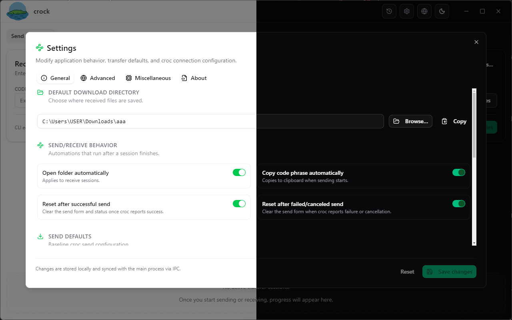

# Crock UI


> A polished Electron + React desktop companion for [croc](https://github.com/schollz/croc) that makes peer-to-peer file and text transfers friendly, observable, and configurable without touching the CLI.

## Table of contents

- [Crock UI](#crock-ui)
  - [Table of contents](#table-of-contents)
  - [Overview](#overview)
  - [Key features](#key-features)
  - [Screenshots](#screenshots)
  - [Architecture](#architecture)
    - [Renderer (React + Vite)](#renderer-react--vite)
    - [Preload bridge](#preload-bridge)
    - [Main process](#main-process)
  - [Project structure](#project-structure)
  - [Getting started](#getting-started)
    - [Prerequisites](#prerequisites)
    - [Install dependencies](#install-dependencies)
    - [Run the app](#run-the-app)
  - [Available scripts](#available-scripts)
  - [Building \& packaging](#building--packaging)
  - [Configuration \& data storage](#configuration--data-storage)
  - [Internationalisation](#internationalisation)
  - [Deeplink](#deeplink)
  - [Roadmap](#roadmap)
  - [Known issues \& limitations](#known-issues--limitations)
  - [Troubleshooting](#troubleshooting)
  - [Contributing](#contributing)
  - [Acknowledgements](#acknowledgements)
  - [License](#license)

## Overview

Crock UI wraps the battle-tested `croc` CLI in a modern desktop experience. It bundles croc binaries for the current platform, keeps them up to date, and exposes common workflows through a visual interface. Beneath the surface it uses a hardened Electron main process, a React + Vite renderer, Zustand for state, Tailwind/shadcn components for styling, and a dedicated IPC layer that mirrors the behaviours of the CLI.

## Key features

- **Instant send & receive** — Queue files or plain text, choose a relay, and kick off croc transfers with a single click.
- **Code phrase ergonomics** — Generate, copy, paste, or scan QR codes for session codes; the UI keeps clipboard and form state in sync.
- **Transfer observability** — Track real-time progress, inspect structured logs, and revisit prior sessions via the built-in history viewer.
- **Configurable defaults** — Adjust send/receive flags, destinations, and automation toggles across General, Advanced, Misc, and About tabs.
- **Relay & proxy health checks** — Test the configured relay, proxy, and croc binary; receive live relay status events streamed from the main process.
- **Binary lifecycle management** — Download, install, or pin croc releases directly from GitHub without leaving the app.
- **Theming & localisation** — Light, dark, and system themes plus English, Vietnamese, and Japanese translations out of the box.
- **Browser-friendly mock API** — In non-Electron contexts a safe mock `window.api` keeps the renderer functional for design previews.

## Screenshots

| Send                                  | Receive                                     | History                                      | Settings                                               |
| ------------------------------------- | ------------------------------------------- | -------------------------------------------- | ------------------------------------------------------ |
|  |  |  |  |

Additional previews reside in [`./screenshots`](./screenshots).

## Architecture

The application is split across three collaborating layers:

### Renderer (React + Vite)

- Bootstrapped by `src/main.tsx`, rendering `App.tsx` into the DOM.
- Uses Zustand stores (`src/stores`) to model UI, settings, history, and transfer state.
- Interfaces with Electron via a typed `window.api` bridge (`src/lib/window-api.ts`).
- Tailwind CSS and shadcn-inspired primitives (`src/components/ui`) drive design consistency.
- Internationalisation is powered by `react-i18next` with JSON resource bundles in `src/locales`.

### Preload bridge

- `electron/preload.ts` exposes a whitelisted, type-safe API to the renderer.
- Bridges file dialogs, clipboard, window controls, croc lifecycle commands, history access, and settings mutations.
- Provides an event bus (`events.on`) for streaming relay status and progress updates to the UI.

### Main process

- `electron/main.ts` configures the BrowserWindow, single-instance lock, external link handling, and lifecycle integration.
- Services in `electron/services` manage croc binaries, build commands, spawn processes, monitor relays, and persist history/settings via `electron-store`.
- IPC handlers in `electron/ipc/modules` wrap those services into cohesive request/response channels.
- `vite-plugin-electron` builds and hot-reloads the main/preload code alongside the renderer during development.

## Project structure

```text
crock/
├─ electron/              # Main-process code, preload bridge, IPC modules, services
├─ public/                # Static assets bundled at runtime (logo, icons)
├─ src/                   # React renderer (components, stores, hooks, contexts)
│  ├─ components/         # UI elements grouped by feature (transfer, settings, history)
│  ├─ lib/                # Utilities (i18n, window API, helpers)
│  ├─ locales/            # i18next resource bundles (en, ja, vi)
│  ├─ providers/          # Theme provider & shared contexts
│  └─ stores/             # Zustand stores synchronised via IPC
├─ dist/                  # Renderer production build output (generated)
├─ dist-electron/         # Compiled main & preload bundles (generated)
├─ electron-builder.json5 # Packaging configuration for installers
├─ package.json           # Scripts, dependencies, electron-builder metadata
└─ pnpm-lock.yaml         # Deterministic dependency lockfile
```

## Getting started

### Prerequisites

- **Node.js** ≥ 18.17 (Electron 30 runtime)
- **pnpm** ≥ 9 (matching the checked-in `pnpm-lock.yaml`)
- macOS, Windows, or Linux desktop environment

### Install dependencies

```pwsh
pnpm install
```

### Run the app

```pwsh
pnpm dev
```

The Vite dev server and Electron process will launch together. Changes to renderer, main, or preload code hot-reload automatically.

## Available scripts

| Script         | Purpose                                                                          |
| -------------- | -------------------------------------------------------------------------------- |
| `pnpm dev`     | Launch Vite + Electron in development mode with hot reload.                      |
| `pnpm build`   | Type-check, build renderer bundles, and package Electron via `electron-builder`. |
| `pnpm lint`    | Run ESLint across `.ts` and `.tsx` sources.                                      |
| `pnpm preview` | Serve the built renderer for inspection without Electron.                        |
| `pnpm format`  | Format project sources with Prettier using the configured glob.                  |

## Building & packaging

```pwsh
pnpm build
```

The build pipeline performs the following:

1. `tsc` validates TypeScript types for both renderer and Electron code.
2. Vite emits production bundles under `dist/`.
3. `electron-builder` packages the application using [`electron-builder.json5`](./electron-builder.json5), producing platform-specific installers in the `dist/` directory.

Adjust icons, app identifiers, update channels, and signing options inside `electron-builder.json5` to fit your distribution strategy.

## Configuration & data storage

- Settings and history are persisted with [`electron-store`](https://github.com/sindresorhus/electron-store) in the user-specific `app.getPath('userData')` directory (varies by OS).
- Croc binaries are cached under `<userData>/bin` with an accompanying manifest to track versions.
- Transfer logs and relay health are streamed from the main process; background monitors stop automatically when the window closes.
- Relay status updates originate from `RelayStatusMonitor` and arrive via the `relay:status` event channel.

## Internationalisation

- Default language is Vietnamese (`vi`), with English (`en`) and Japanese (`ja`) translations bundled.
- Translation resources live in `src/locales/<lang>/translation.json` and are loaded by `src/lib/i18n.ts`.
- To add a new language, duplicate an existing locale file, add the language code to `supportedLanguages`, and update UI copy as needed.

## Deeplink

```pwsh
croc://receive?code=<code-phrase>[&relay=<relay-host>][&password=<relay-password>]
```

**Parameters:**

- `code` (required): The croc code phrase to receive files
- `relay` (optional): Custom relay server (host:port format)
- `password` (optional): Relay server password

**Examples:**

1. Basic receive:

    ```pwsh
    croc://receive?code=7243-aurora-ceiling-collect
    ```

2. With custom relay:

    ```pwsh
    croc://receive?code=7243-aurora-ceiling-collect&relay=custom.relay.com:9009
    ```

3. With relay and password:

    ```pwsh
    croc://receive?code=7243-aurora-ceiling-collect&relay=custom.relay.com:9009&password=secret
    ```

## Roadmap

- **Keyboard shortcuts** – Wire global accelerator handling for opening history (`Ctrl+H`) and settings (`Ctrl+,`) from both renderer and main process.
- **Settings redesign** – Simplify copy and grouping across the Settings dialog tabs, removing redundant controls and tightening spacing.
- **Type cleanup** – Prune duplicate or unused TypeScript definitions in `src/types` and `electron/types` to reduce maintenance overhead.

## Known issues & limitations

- **Proxy diagnostics are shallow** – `ConnectionDiagnostics` (`electron/services/ConnectionDiagnostics.ts`) only reports whether proxy URLs are configured; it does not attempt any connectivity checks, so proxy misconfiguration goes unnoticed.
- **No SOCKS5 proxy UI** – The backend understands SOCKS5 (`electron/services/CrocCommandBuilder.ts`, `electron/services/SettingsStore.ts`), but the settings dialog only exposes HTTP/HTTPS fields. Users cannot currently edit SOCKS5 relay defaults from the UI.
- **Renderer requires Electron bridge** – `getWindowApi()` (`src/lib/window-api.ts`) throws when `window.api` is absent. Serving the renderer with plain Vite (without the preload script) will break as soon as settings or transfer actions touch the bridge. A lightweight browser mock is not yet implemented.
- **Drag-n-Drop**: Due to Electron's security limits, drag-n-drop action from renderer side couldn't get the absolute path on the disk. I will try to find a workaround but not promised.

## Troubleshooting

- TypeScript warnings about unsupported versions come from `@typescript-eslint` if you use a newer compiler; either align the TypeScript version or pin a supported range.
- When running outside Electron (e.g., `pnpm preview`), certain bridge features are mocked. Use the full Electron runtime for transfer tests.
- If relay checks fail, confirm network access to your chosen relay, or update the relay settings under **Settings → Advanced**.

## Contributing

Contributions are welcome! Please open an issue or pull request on [GitHub](https://github.com/KD-MM2/crock) describing the enhancement or fix. When submitting changes:

1. Install dependencies with `pnpm install`.
2. Ensure linting passes (`pnpm lint`).
3. Describe testing steps and screenshots when UI changes are involved.

## Acknowledgements

- [croc](https://github.com/schollz/croc) — peer-to-peer transfer utility that powers the underlying protocol.
- [Electron](https://www.electronjs.org/), [Vite](https://vitejs.dev/), and [React](https://react.dev/) for the developer experience.
- UI primitives influenced by [shadcn/ui](https://ui.shadcn.com/).

## License

This project is distributed under the [MIT License](./LICENSE). See the license file for full terms and attribution requirements.
