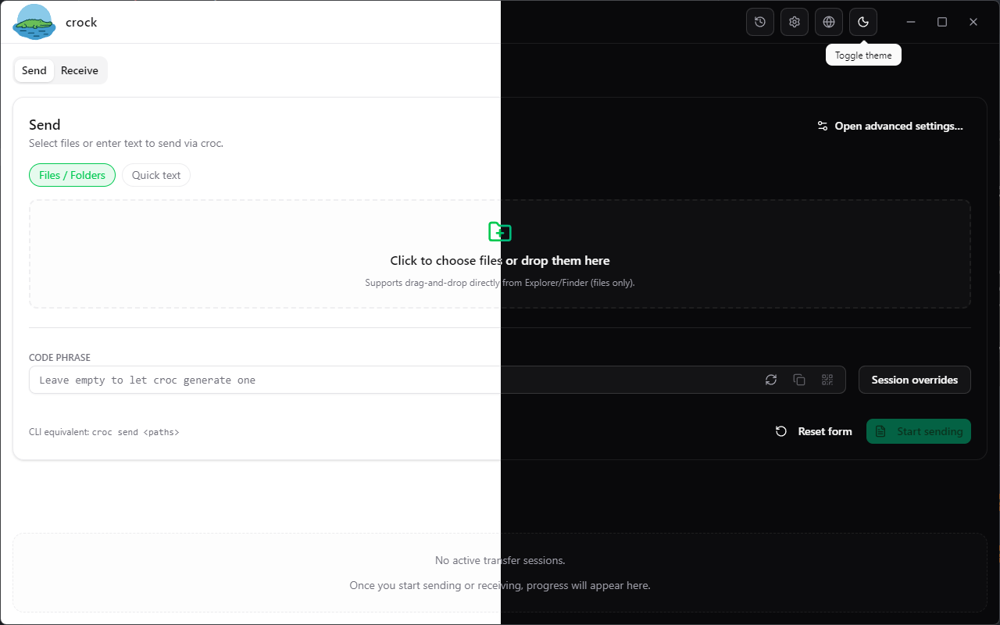

# 🥐 Crock UI

Giao diện desktop cho [croc](https://github.com/schollz/croc) được xây dựng bằng Electron và React. Ứng dụng mang tới trải nghiệm trực quan để gửi/nhận tệp hoặc văn bản, theo dõi tiến trình, xem lại lịch sử và cấu hình croc mà không cần ghi nhớ lệnh CLI.

## Mục lục

- [🥐 Crock UI](#-crock-ui)
  - [Mục lục](#mục-lục)
  - [Tổng quan](#tổng-quan)
  - [Tính năng nổi bật](#tính-năng-nổi-bật)
  - [Ảnh chụp màn hình](#ảnh-chụp-màn-hình)
  - [Kiến trúc](#kiến-trúc)
    - [Renderer (React + Vite)](#renderer-react--vite)
    - [Preload bridge](#preload-bridge)
    - [Tiến trình chính](#tiến-trình-chính)
  - [Cấu trúc dự án](#cấu-trúc-dự-án)
  - [Bắt đầu](#bắt-đầu)
    - [Yêu cầu](#yêu-cầu)
    - [Cài đặt phụ thuộc](#cài-đặt-phụ-thuộc)
    - [Chạy ứng dụng](#chạy-ứng-dụng)
  - [Các script khả dụng](#các-script-khả-dụng)
  - [Quy trình build \& đóng gói](#quy-trình-build--đóng-gói)
  - [Cấu hình \& lưu trữ dữ liệu](#cấu-hình--lưu-trữ-dữ-liệu)
  - [Đa ngôn ngữ](#đa-ngôn-ngữ)
  - [Lộ trình phát triển](#lộ-trình-phát-triển)
  - [Vấn đề đã biết \& giới hạn](#vấn-đề-đã-biết--giới-hạn)
  - [Khắc phục sự cố](#khắc-phục-sự-cố)
  - [Đóng góp](#đóng-góp)
  - [Lời cảm ơn](#lời-cảm-ơn)
  - [Giấy phép](#giấy-phép)

## Tổng quan

Crock UI gói CLI `croc` trong một ứng dụng desktop hiện đại. Ứng dụng đi kèm và tự quản lý phiên bản croc phù hợp nền tảng, cung cấp các luồng thao tác quen thuộc qua giao diện đồ họa. Bên dưới là tiến trình Electron ổn định, renderer React + Vite, Zustand giữ trạng thái, hệ thống UI dựa trên Tailwind/shadcn và lớp IPC phản ánh hành vi của CLI.

## Tính năng nổi bật

- **Gửi & nhận tức thì** — Thêm tệp hoặc văn bản, chọn relay và bắt đầu chuyển chỉ với một cú nhấp.
- **Mã phiên tiện dụng** — Sinh code-phrase, sao chép, dán hoặc quét mã QR; ứng dụng đồng bộ clipboard và biểu mẫu.
- **Quan sát chuyển giao** — Theo dõi tiến trình theo thời gian thực, xem log cấu trúc, mở lại phiên cũ qua trình xem lịch sử.
- **Tùy chỉnh mặc định** — Điều chỉnh tham số gửi/nhận, đích đến, tự động hóa trong các tab General, Advanced, Misc và About.
- **Kiểm tra relay & proxy** — Thử relay, proxy, binary croc; nhận sự kiện trạng thái relay trực tiếp từ tiến trình chính.
- **Quản lý vòng đời binary** — Tải xuống, cài đặt, ghim phiên bản croc từ GitHub mà không rời ứng dụng.
- **Chủ đề & bản địa hóa** — Giao diện sáng/tối và bộ ngôn ngữ Anh, Việt, Nhật sẵn sàng.
- **Mock API thân thiện trình duyệt** — Trong môi trường không phải Electron, mock `window.api` giữ renderer hoạt động cho nhu cầu thiết kế.

## Ảnh chụp màn hình

| Send                           | Receive                            | History                               | Settings                                       |
| ------------------------------ | ---------------------------------- | ------------------------------------- | ---------------------------------------------- |
|  |  |  |  |

Thư mục [`./screenshots`](./screenshots) chứa thêm nhiều ảnh minh họa.

## Kiến trúc

Ứng dụng được chia thành ba lớp phối hợp.

### Renderer (React + Vite)

- Khởi chạy từ `src/main.tsx` và render `App.tsx`.
- Sử dụng các store Zustand (`src/stores`) cho UI, cài đặt, lịch sử và trạng thái chuyển.
- Giao tiếp với Electron qua cầu nối `window.api` có định kiểu (`src/lib/window-api.ts`).
- Hệ thống UI dựa trên Tailwind CSS và các thành phần shadcn (`src/components/ui`).
- `react-i18next` cùng JSON tài nguyên trong `src/locales` cung cấp đa ngôn ngữ.

### Preload bridge

- `electron/preload.ts` phơi bày API an toàn, được whitelists cho renderer.
- Kết nối hộp thoại file, clipboard, điều khiển cửa sổ, lifecycle của croc, truy xuất lịch sử và cập nhật cài đặt.
- Cung cấp bus sự kiện (`events.on`) để stream trạng thái relay và tiến trình tới UI.

### Tiến trình chính

- `electron/main.ts` cấu hình BrowserWindow, khóa single-instance, xử lý liên kết ngoài và vòng đời ứng dụng.
- Các service trong `electron/services` quản lý binary croc, dựng lệnh, spawn tiến trình, giám sát relay và lưu lịch sử/cài đặt bằng `electron-store`.
- `electron/ipc/modules` gói các service thành kênh IPC dạng request/response.
- `vite-plugin-electron` hỗ trợ build và hot reload đồng thời main, preload và renderer trong môi trường dev.

## Cấu trúc dự án

```text
crock/
├─ electron/              # Mã nguồn main process, preload, module IPC, service
├─ public/                # Tài nguyên tĩnh đi kèm (logo, icon)
├─ src/                   # Renderer React (component, store, hook, context)
│  ├─ components/         # UI chia theo chức năng (transfer, settings, history)
│  ├─ lib/                # Tiện ích (i18n, window API, helper)
│  ├─ locales/            # Gói dịch i18next (en, ja, vi)
│  ├─ providers/          # Provider chủ đề và context dùng chung
│  └─ stores/             # Store Zustand đồng bộ qua IPC
├─ dist/                  # Bundle renderer khi build production (tạo ra)
├─ dist-electron/         # Kết quả build main & preload (tạo ra)
├─ electron-builder.json5 # Cấu hình đóng gói installer
├─ package.json           # Script, dependency, metadata
└─ pnpm-lock.yaml         # Khóa phụ thuộc
```

## Bắt đầu

### Yêu cầu

- **Node.js** ≥ 18.17 (Runtime Electron 30)
- **pnpm** ≥ 9 (khớp với `pnpm-lock.yaml`)
- Máy tính chạy macOS, Windows hoặc Linux

### Cài đặt phụ thuộc

```pwsh
pnpm install
```

### Chạy ứng dụng

```pwsh
pnpm dev
```

Vite dev server và tiến trình Electron sẽ khởi động cùng lúc. Thay đổi ở renderer, main hoặc preload sẽ được hot reload ngay lập tức.

## Các script khả dụng

| Script         | Mục đích                                                                   |
| -------------- | -------------------------------------------------------------------------- |
| `pnpm dev`     | Khởi chạy Vite + Electron chế độ dev với hot reload.                       |
| `pnpm build`   | Kiểm tra kiểu, build renderer và đóng gói Electron qua `electron-builder`. |
| `pnpm lint`    | Chạy ESLint trên toàn bộ mã nguồn `.ts` và `.tsx`.                         |
| `pnpm preview` | Phục vụ bundle renderer đã build để xem thử không cần Electron.            |
| `pnpm format`  | Format mã nguồn bằng Prettier theo glob cấu hình.                          |

## Quy trình build & đóng gói

```pwsh
pnpm build
```

Pipeline build sẽ:

1. Chạy `tsc` để kiểm tra kiểu cho renderer và Electron.
2. Vite xuất bundle production vào `dist/`.
3. `electron-builder` đọc [`electron-builder.json5`](./electron-builder.json5) và tạo installer theo từng nền tảng trong thư mục `release/`.

Bạn có thể chỉnh icon, app ID, kênh cập nhật hoặc ký số trong `electron-builder.json5`.

## Cấu hình & lưu trữ dữ liệu

- Cài đặt và lịch sử được lưu bằng [`electron-store`](https://github.com/sindresorhus/electron-store) tại thư mục `app.getPath('userData')` của từng người dùng.
- Binary croc được cache tại `<userData>/bin` kèm manifest để theo dõi phiên bản.
- Log chuyển giao và trạng thái relay được stream từ tiến trình chính; các monitor nền tự dừng khi đóng cửa sổ.
- Cập nhật relay bắt nguồn từ `RelayStatusMonitor` và đi qua kênh sự kiện `relay:status`.

## Đa ngôn ngữ

- Mặc định sử dụng tiếng Việt (`vi`); gói kèm tiếng Anh (`en`) và tiếng Nhật (`ja`).
- Tệp dịch nằm trong `src/locales/<lang>/translation.json`, được nạp bởi `src/lib/i18n.ts`.
- Muốn thêm ngôn ngữ mới, hãy nhân bản file hiện có, thêm mã vào `supportedLanguages` và cập nhật copy giao diện.

## Lộ trình phát triển

- **Hỗ trợ deep link** — Khôi phục và củng cố xử lý `croc://` để tự động điền luồng nhận.
- **Phím tắt toàn cục** — Thêm accelerator mở lịch sử (`Ctrl+H`) và cài đặt (`Ctrl+,`) ở renderer và main.
- **Làm mới lịch sử** — Tối ưu layout cột, empty state và khả năng truy cập của bảng lịch sử.
- **Tái thiết kế Settings** — Tinh gọn copy, nhóm lại các control và tối ưu khoảng cách.
- **Dọn dẹp kiểu** — Loại bỏ định nghĩa TypeScript trùng/lỗi thời trong `src/types` và `electron/types`.

## Vấn đề đã biết & giới hạn

- **Cảnh báo ESLint + TypeScript** — `pnpm lint` cảnh báo do `@typescript-eslint/typescript-estree` mới hỗ trợ TypeScript < 5.6, trong khi dự án dùng 5.9. Cập nhật compiler hoặc lint tool sẽ khắc phục.
- **Chẩn đoán proxy còn hạn chế** — `ConnectionDiagnostics` (`electron/services/ConnectionDiagnostics.ts`) chỉ báo có cấu hình proxy hay không, chưa kiểm tra khả năng kết nối nên dễ bỏ sót lỗi cấu hình.
- **Thiếu UI cho SOCKS5** — Backend hỗ trợ SOCKS5 (`electron/services/CrocCommandBuilder.ts`, `electron/services/SettingsStore.ts`) nhưng giao diện chỉ có trường HTTP/HTTPS nên chưa chỉnh được SOCKS5 mặc định.
- **Renderer phụ thuộc bridge Electron** — `getWindowApi()` (`src/lib/window-api.ts`) sẽ throw nếu thiếu `window.api`. Khi chạy Vite đơn thuần không preload, mọi thao tác dùng bridge (cài đặt, chuyển file) sẽ lỗi ngay. Mock cho trình duyệt còn chưa hoàn thiện.
- **Cột dung lượng lịch sử lỗi định dạng** — Bảng lịch sử đôi lúc thiếu hoặc hiển thị sai kích thước, khiến phiên dài không có tổng dung lượng chính xác.
- **Drag-n-Drop**: Do các hạn chế về bảo mật của Electron, thao tác kéo-thả từ phía renderer không thể lấy được đường dẫn tuyệt đối trên ổ đĩa. Tôi sẽ cố gắng tìm cách khắc phục, nhưng không đảm bảo thành công.

## Khắc phục sự cố

- Cảnh báo TypeScript do phạm vi hỗ trợ của `@typescript-eslint`; hãy đồng bộ phiên bản hoặc nâng cấp công cụ lint.
- Khi chạy ngoài Electron (ví dụ `pnpm preview`), một số API được mock — hãy dùng bản Electron để test chuyển file.
- Nếu kiểm tra relay thất bại, kiểm tra kết nối mạng tới relay hoặc cập nhật tại **Settings → Advanced**.

## Đóng góp

1. Fork repository và tạo branch mới.
2. Thực hiện thay đổi, đảm bảo `pnpm lint` chạy thành công.
3. Tạo pull request kèm mô tả rõ ràng; cung cấp screenshot khi có thay đổi UI.

## Lời cảm ơn

- [croc](https://github.com/schollz/croc) — công cụ chuyển P2P làm nền tảng.
- [Electron](https://www.electronjs.org/), [Vite](https://vitejs.dev/), [React](https://react.dev/) — bộ ba cho trải nghiệm phát triển hiện đại.
- Thành phần UI lấy cảm hứng từ [shadcn/ui](https://ui.shadcn.com/).

## Giấy phép

Phần mềm phát hành theo [MIT License](./LICENSE). Vui lòng xem file giấy phép để biết đầy đủ điều khoản và yêu cầu ghi công.
